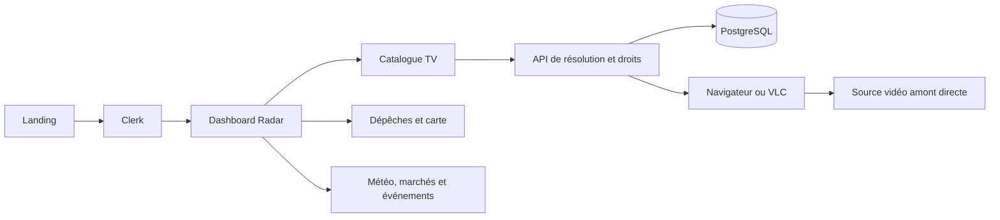

# Africa Live — Architecture et agencement du dashboard

Analyse du 30 septembre 2026, fuseau Africa/Dakar.
Périmètre : code local, parcours public du staging et session staging existante.
Le staging a été consulté, sans déploiement ni changement d’infrastructure.

## Décision produit exprimée par le propriétaire

Plan d’exécution associé : [plan complet et backlog dashboard](plan-dashboard-backlog.md).

La landing présente Africa Live. Après connexion, le dashboard est l’entrée
principale. La TV devient une fonction secondaire, accessible par un petit
bouton sur le côté du dashboard. La carte, les dépêches et les informations
par pays constituent donc le cœur de l’expérience.

Les URLs restent compatibles : `/` pour la présentation, `/app/live` pour
le dashboard, `/app` pour la TV et `/player/[channelId]` pour le lecteur séparé.
Un changement d’URL du catalogue n’est pas nécessaire pour établir cette hiérarchie.

## Ce que l’application propose effectivement

| Espace | Fonction actuelle | Rôle dans la nouvelle organisation |
|---|---|---|
| Landing | Présentation, inscription, tarifs, FAQ | Expliquer la veille et conduire au dashboard |
| Dashboard Radar | Carte, RSS/GDELT, marchés, météo, briefing, accès TV par pays | Espace principal après connexion |
| Catalogue TV | Recherche, pays, langue, catégories, favoris, pagination | Outil spécialisé accessible depuis le dashboard |
| Lecteurs | Modale, fenêtre séparée, navigateur ou VLC | Visionnage direct des sources disponibles |
| Compte | Identité Clerk, état des droits, échéance | Gestion personnelle et renouvellement |
| Administration | File privée de demandes de contact/retrait | Exploitation réservée aux administrateurs |

Africa Live organise des sources et autorise leur consultation. Le serveur
ne transporte pas la vidéo : le navigateur ou VLC contacte l’amont directement.
La carte donne accès aux médias et aux chaînes d’un pays ; elle ne garantit
pas qu’une émission montre le lieu ou l’événement décrit par une dépêche.

## Architecture technique

Application Next.js 16.3.5 App Router, React 19, TypeScript et Tailwind 4.
Il s’agit d’une application intégrée avec des modules métier, plutôt que de
plusieurs services indépendants.

- `src/app` : pages et routes API ; `src/proxy.ts` : protection Clerk et modes locaux.
- `src/components` : catalogue, filtres, lecteurs et interfaces Radar.
- `src/lib` : droits, contrats Zod, catalogue, résolution, quotas, collecteurs et caches.
- `src/db` : PostgreSQL via Drizzle et pool `pg` ; migrations versionnées dans `drizzle`.
- `src/scripts` : import, qualification de flux, maintenance, diagnostics et opérations.
- `src/inngest` : réconciliation des transactions NabooPay.

Les droits sont évalués côté serveur : identité, essai de cinq jours,
abonnement, grâce, expiration, blocage et accès administrateur.
Les API distinguent consultation du catalogue et autorisation de lecture.
La résolution crée des sessions/tentatives, contrôle l’éligibilité et la
fraîcheur des sources, puis le lecteur gère erreurs, changements de chaîne
et secours. Les pages ne doivent pas remplacer ces décisions par un état visuel.

Le Radar utilise des collecteurs séparés : GDELT, RSS, Open-Meteo,
USGS/GDACS, NASA FIRMS et marchés. La carte MapLibre est chargée côté client,
avec des fonds externes. Les services ont des caches mémoire de durées
différentes ; ces caches sont propres au processus et ne constituent pas
une base partagée entre plusieurs répliques.

## Observations sur staging

- La landing présentait essentiellement la TV et envoyait vers `/app`.
- Le dashboard chargé affichait 79 résultats, 14 pays et 371 chaînes africaines,
  dont 130 annoncées web. Ce sont des observations de session, pas un inventaire
  permanent ni une preuve que chaque chaîne joue actuellement.
- Le bouton « 19 direct » d’une dépêche sénégalaise a ouvert les 19 chaînes
  du Sénégal dans le panneau du Radar. C’est un parcours central à conserver.
- Le briefing Sénégal s’est ouvert et a affiché ses quatre rubriques.
- La recherche « Seneweb » a retourné Seneweb TV ; sa modale a affiché une
  vidéo dans le navigateur. Cet essai ne valide pas le reste du catalogue.
- Les filtres exposent encore des catégories comme `Business;News`, `Undefined`
  et des codes de langues non traduits. L’ordre alphabétique initial présente
  beaucoup de chaînes internationales avant les chaînes africaines.
- Les deux pages ont des en-têtes différents et le changement de page ne
  conserve pas actuellement le pays sélectionné dans l’URL.

## Changements préparés localement

1. Entrées de la landing, retours par défaut Clerk, accès depuis compte,
   offres, paiement réussi et page 404 dirigés vers `/app/live`.
2. Entrée des manifestes PWA et raccourcis du mode local alignés sur le dashboard.
3. Landing recentrée sur la veille, avec un aperçu explicitement illustratif,
   des fonctionnalités dashboard avant les catégories TV et un message cohérent.
4. Gros bouton TV jaune remplacé par un bouton compact « TV » à droite
   de l’en-tête du dashboard, avec un nom accessible explicite.
5. Catalogue, lecteurs, favoris, règles d’accès et transport vidéo conservés.

Le fallback Clerk définit la destination par défaut. Un lien explicite vers
une page protégée peut toujours conserver sa destination après connexion.
La logique existante d’abonnement continue de s’appliquer au dashboard.

## Prochaines améliorations recommandées

### Priorité 1 — Clarifier les données et les promesses

- Le briefing actuel assemble des textes déterministes. Le commentaire évoque
  un enrichissement Gemini, mais aucun appel génératif n’est présent dans ce
  service. Le nom « Briefing IA » devrait refléter le traitement réellement livré.
- Le briefing ne filtre pas les articles par date pour imposer douze heures.
  Le collecteur RSS conserve des articles de dates diverses ; le compteur
  « résultats chargés · 24 h » mélange RSS et GDELT sans filtre global de 24 h.
  Afficher une fenêtre exacte ou retirer la durée annoncée.
- Des erreurs de collecteurs sont converties en listes vides dans le briefing,
  puis peuvent produire un texte rassurant. Distinguer absence de données,
  absence d’événements recensés et indisponibilité du fournisseur.
- Le compteur de chaînes actives exclut certains états offline mais ne vérifie
  pas à lui seul tous les critères du résolveur. Le qualifier comme catalogue
  référencé, ou appliquer le même contrat de disponibilité à tous les espaces.
- Le bandeau présente des événements hors Afrique et des articles économiques
  anciens sans date visible. Ajouter périmètre, date et fraîcheur.

### Priorité 2 — Faire du dashboard un espace de travail

- Réduire la hauteur de l’introduction et des indicateurs pour rapprocher
  carte et dépêches du haut de l’écran. Garder le grand titre pour la landing.
- Ajouter un sélecteur de pays utilisable sans manipuler la carte.
- Conserver le pays dans l’URL pour partager une vue et revenir au même contexte.
- Proposer des couches de carte progressivement : médias/TV au départ,
  risques et feux à la demande, avec dates et légende distinctes.
- Sur mobile, donner accès au fil et au pays avant la grande carte ; les
  indicateurs occupent actuellement quatre rangées avant le contenu principal.
- Afficher l’état de chaque source plutôt qu’un indicateur « veille active »
  uniquement lié à l’horloge et à la présence de l’interface.

### Priorité 3 — Harmoniser la TV et la navigation

- Présenter une navigation stable : Dashboard, TV, Compte ; administration
  selon le rôle. Le logo d’un espace connecté pourrait revenir au dashboard.
- Traduire et normaliser les catégories et langues. Les raccourcis actuels
  filtrent par égalité stricte : `News` ne recouvre pas `Business;News`.
- Faire piloter filtres et raccourcis par une même source d’état ; aujourd’hui
  la sidebar garde ses valeurs tandis que les catégories modifient l’état parent.
- Proposer des entrées Afrique, Sénégal et favoris tout en conservant
  l’accès à l’ensemble du catalogue autorisé.
- Envisager un lecteur ancré avec liste de zapping pour le visionnage prolongé.
  Préserver la modale et la fenêtre séparée comme options compatibles.

### Cohérence technique et documentaire

Le layout `/app` redirige toujours les comptes sans droit actif vers le compte,
alors que les API catalogue autorisent leur consultation après expiration.
Cette divergence mérite un test avec un compte expiré et une décision explicite ;
elle n’a pas été modifiée dans ce lot. La session staging observée est administrateur.

Le handoff et certains runbooks sont antérieurs aux couches Radar observées
aujourd’hui. Distinguer état documenté, code local et comportement réellement
déployé avant de reprendre des chiffres ou déclarer une fonctionnalité livrée.

Les essais locaux ont aussi produit des avertissements React de clés dupliquées
dans les listes de dépêches Ecofin et certains filtres, ainsi qu’une erreur de
chargement de worker de carte. Ces problèmes restent à diagnostiquer séparément
des changements de navigation livrés ici.

## Vérification et limites

- TypeScript et ESLint : réussis sur l’ensemble des changements finaux.
- E2E landing : réussi, y compris largeur 390 px.
- E2E MVP : entrée `/` → dashboard → bouton TV → catalogue, ouverture/fermeture
  du lecteur et pagination : réussi sur `http://localhost:3001`.
- Inspection mobile du dashboard : largeur de contenu 385 px pour une fenêtre
  de 390 px ; bouton TV accessible dans l’en-tête.
- Premier essai MVP sur `127.0.0.1` refusé par le contrôle d’origine local.
  Le test a réussi sur l’origine `localhost` attendue, sans modifier ce contrôle.
- Aucun paiement, webhook réel, compte expiré ou accès utilisateur standard
  n’a été testé dans cette session. Pas de benchmark ni d’audit de sécurité complet.
- Aucun commit, push, déploiement, migration ou changement d’environnement distant.
- Serveur local remis dans son mode Clerk habituel après les essais MVP.

Capture : [dashboard local](screenshots/dashboard-entry-local.jpg).
Capture : [landing locale](screenshots/landing-dashboard-local.jpg).
