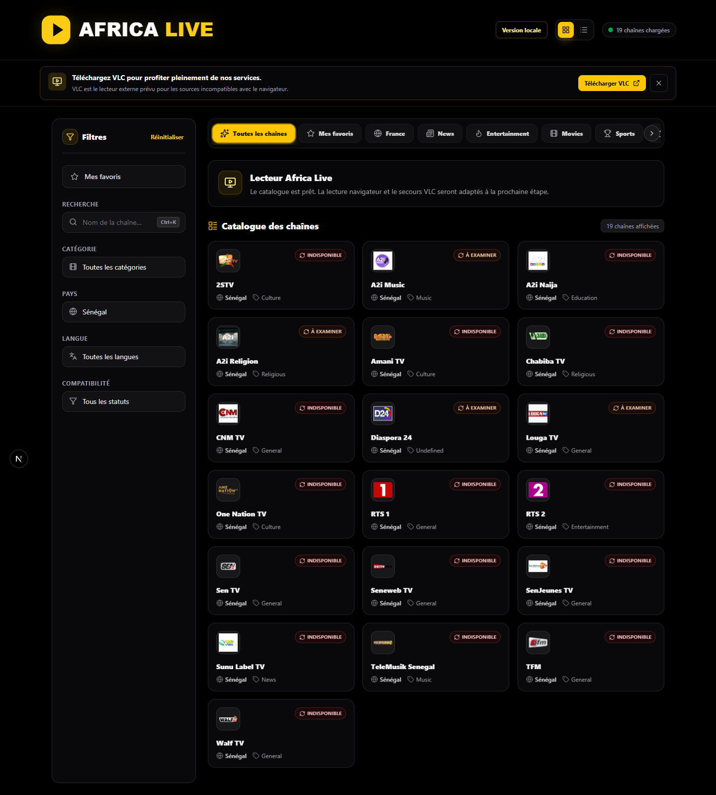

# Lot 1 — Base locale Africa Live

Vérifié le 16 septembre 2026.

## Périmètre livré

- Copie indépendante du code IPTV, sans ses secrets, sa base SQLite ni son Git.
- Base PostgreSQL dédiée `africa_live_dev`.
- 11 778 chaînes et 12 396 sources copiées dans une transaction, avec
  comparaison SHA-256 des lignes source et cible après insertion.
- Métadonnées d’import nécessaires aux références du catalogue conservées.
- Aucun utilisateur, abonnement, favori ou événement de lecture IPTV copié.
- Un utilisateur technique local créé ; favoris de test nettoyés.
- Accès sans Clerk uniquement en développement local, serveur lié à 127.0.0.1.
- Catalogue complet, recherche, filtres, pagination et favoris persistants.
- Affichage des chaînes sans succès de vérification, jusque-là masquées.
- Identité Africa Live et polices système sans téléchargement Google Fonts.

## Contrôles réussis

| Contrôle | Résultat |
|---|---|
| Tests Node | 104 réussis, 4 intégrations facultatives ignorées |
| Invariants sans relais média | 3 réussis |
| TypeScript | Réussi |
| ESLint | Réussi |
| Intégrité des migrations | Réussie |
| Absence de dérive PostgreSQL | Confirmée |
| Build Next.js | Réussi |
| Essais Edge | 3 réussis |

Les essais Edge couvrent l’accès sans compte et la pagination, la recherche
d’une chaîne jamais vérifiée, le filtre Sénégal et les favoris après
rechargement. Ils utilisent les API et la base locale réelles.

## Limites et prochaine étape

La lecture n’a pas été revalidée sur le réseau. Les statuts repris d’IPTV datent
de juillet et les succès sont expirés selon la règle de fraîcheur existante.
La présence au catalogue ne constitue pas une preuve de lecture actuelle.

L’ouverture VLC locale reste désactivée. Le prochain lot adaptera la sélection
des sources, la lecture web directe et le secours VLC automatique, en conservant
l’absence totale de relais et de conversion vidéo côté serveur.

Aucun commit, push ou déploiement réalisé.

