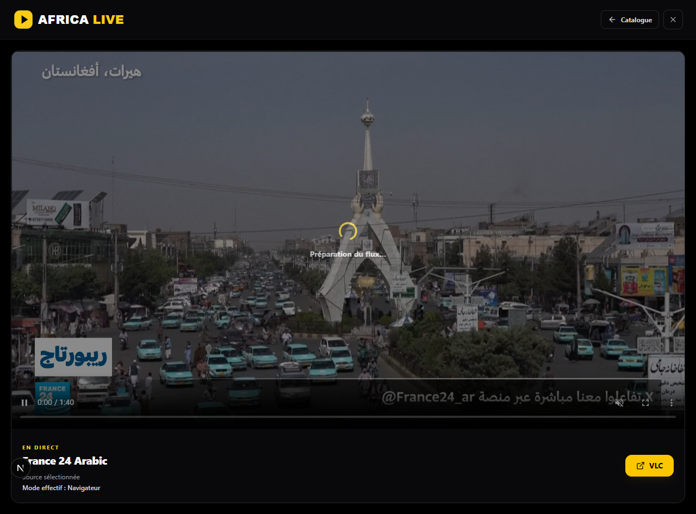

# Lot 2 — Lecture directe et secours VLC local

Vérifié le 16 septembre 2026.

## Comportement livré

Toutes les chaînes du catalogue sont cliquables en mode local. Les sources
HTTP(S) sont essayées dans le navigateur ; les sources historiquement réservées
à VLC sans CORS passent directement au lecteur externe. Les anciens échecs,
contrôles expirés et paramètres d’URL ne bloquent pas les essais locaux.
La politique de production et ses contrôles d’accès restent inchangés.

Le lecteur essaie au plus trois sources web, puis ouvre automatiquement VLC.
Les échecs de chargement, de codec et les blocages persistants déclenchent ce
secours. Un refus de lecture automatique du navigateur conserve le bouton de
lecture et ne déclenche pas VLC.

VLC est détecté dans les installations Windows usuelles ou via `VLC_PATH`.
L’ouverture transmet uniquement une source sélectionnée côté serveur. Le client
ne peut pas fournir une URL arbitraire. Les demandes répétées avec le même
identifiant de lancement sont regroupées dans le processus local. Une erreur
d’installation affiche une action de nouvelle tentative.

## Vérification

- Tests Node : 109 réussis, 4 intégrations facultatives ignorées.
- Invariants sans relais média : 3 réussis.
- TypeScript, ESLint et build Next.js : réussis.
- Migrations et absence de dérive PostgreSQL : validées.
- Catalogue intact : 11 778 chaînes, 12 396 sources ; fixtures DB supprimées.
- Trois essais catalogue/filtres/favoris, huit essais de lecture et deux essais
  d’API réelle réussis.

Les essais de lecture couvrent le décodage réel de fixtures synthétiques HLS
et MP4, la source alternative, le secours automatique, la limite de trois
essais, l’absence de VLC, la nouvelle tentative, le refus d’autoplay et un
manifeste sans réponse. Les lancements VLC de ces essais navigateur sont simulés.
Les API de sélection et de contrôle d’origine sont aussi testées sans simulation.

## Essais réels séparés

- France 24 Arabic : vidéo décodée dans Edge, quatre requêtes média directes
  vers l’amont observées, aucune demande de secours VLC.
- VLC installé sur la machine : lancement réel confirmé avec une chaîne du
  catalogue. Deux demandes simultanées identiques retournent un succès et
  produisent un seul événement de lancement.

La présence du processus VLC confirme le lancement ; le décodage vidéo dans
VLC n’a pas été mesuré. Ces essais ne constituent pas une revalidation de tout
le catalogue. Les sources restent dépendantes des diffuseurs et du réseau.

Aucun flux n’est relayé, converti ou stocké par Africa Live. Les fichiers média
synthétiques d’essai sont sous `e2e/fixtures`, jamais dans `public` et jamais
servis par une route de l’application. Aucun commit ni push réalisé.

