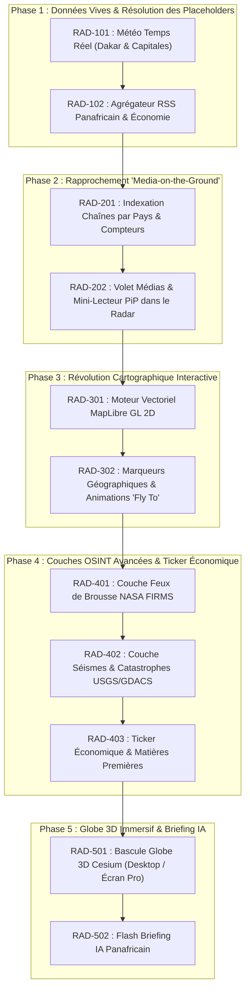

# Africa Live — Plan Directeur & Backlog Opérationnel du Radar Situational

> **Vision :** *"Africa Live — Le Live qui vient à vous."*  
> Transformer la plateforme d’un catalogue IPTV passif en un **Cockpit d'Intelligence Géospatiale et Médiatique Panafricain** (Veille, OSINT, Météo, Dépêches et Chaînes de terrain en incrustation).

---

## Synthèse des Phases et Jalons

---

## Matrice Détaillée du Backlog

| ID | Intitulé | Priorité | Statut | Dépendances | Livrables clés |
|---|---|---|---|---|---|
| **RAD-101** | Météo Temps Réel (Dakar & Capitales) | P0 | **TERMINÉ** | Aucune | `GET /api/live/weather`, Composant météo Dakar/capitales, Open-Meteo CC-BY |
| **RAD-102** | Agrégateur RSS Panafricain & Éco | P0 | **TERMINÉ** | RAD-101 | `src/lib/rss-collector.ts`, `GET /api/live/rss`, flux APS, Ecofin, RFI |
| **RAD-201** | Indexation Chaînes par Pays | P1 | **TERMINÉ** | RAD-102 | Liaison `channels.countryCode`, `GET /api/live/channels?summary=true`, badges TV sur carte & dépêches |
| **RAD-202** | Volet Médias & Mini-Lecteur PiP | P1 | **TERMINÉ** | RAD-201 | Intégration du lecteur HLS/VLC dans le Radar sans rechargement, PiP docked, popout séparé |
| **RAD-301** | Moteur Vectoriel MapLibre GL 2D | P1 | **TERMINÉ** | RAD-202 | Remplacement SVG, tuiles Dark Mode, centrage Afrique `[17.5, 3.5]`, WebGL, 0 clé API |
| **RAD-302** | Marqueurs & "Fly To" Pays | P2 | **TERMINÉ** | RAD-301 | Zoom animé fluide, recentrage automatique au clic dépêche, météo ou TV |
| **RAD-401** | Couche Feux NASA FIRMS | P2 | **TERMINÉ** | RAD-302 | `GET /api/live/firms`, calque thermique WebGL, clustering & popups NRT |
| **RAD-402** | Couche Séismes USGS / GDACS | P2 | **TERMINÉ** | RAD-401 | `GET /api/live/events`, séismes Vallée du Rift, alertes GDACS |
| **RAD-403** | Ticker Économique & Devises | P2 | **TERMINÉ** | RAD-402 | Bandeau cours Cacao, Baril Brent, Or, devises EUR/FCFA |
| **RAD-501** | Bascule Globe 3D Cesium (Desktop) | P3 | **TERMINÉ** | RAD-302 | Vue Globe 3D optionnelle pour stations de travail / grands écrans |
| **RAD-502** | Flash Briefing IA Panafricain | P3 | **TERMINÉ** | RAD-403 | Synthèse quotidienne des événements majeurs par région |

---

## Fiches Techniques Détaillées

### RAD-101 — Météo Temps Réel (Dakar & Capitales)
* **Objectif :** Remplacer le cadre météo vide de `/app/live` par un module météo direct et vivant.
* **Source de données :** Open-Meteo API (Open Data CC-BY 4.0, gratuit, zéro clé API, requêtes par coordonnées GPS).
* **Endpoints cibles :**
  * `GET /api/live/weather?code=SN` (ou `lat=14.69&lon=-17.44` pour Dakar).
  * Cache mémoire en backend de 15 minutes pour préserver les performances.
* **Interface UI :**
  * Température actuelle, ressenti, icône météo dynamique (soleil, orage, brume sèche/Harmattan).
  * Vitesse et direction du vent (essentiel pour la façade atlantique et le Sahel).
  * Sélecteur de villes rapides : **Dakar** (défaut), **Abidjan**, **Bamako**, **Conakry**, **Lagos**, **Kinshasa**.
* **Critères d'acceptation :**
  * Aucune valeur simulée ou statique.
  * Gestion robuste du mode hors ligne ou de panne amont.
  * Mention d'attribution "Données météo : Open-Meteo".

---

### RAD-102 — Agrégateur RSS Panafricain & Économie
* **Objectif :** Compléter la veille brute GDELT par les dépêches éditoriales chaudes des grandes rédactions africaines.
* **Sources intégrées :**
  * **APS** (Agence de Presse Sénégalaise) — Fil national officiel.
  * **Agence Ecofin** — Économie, matières premières, tech, énergie en Afrique.
  * **RFI Afrique** & **BBC Afrique** — Veille continentale.
  * **Jeune Afrique** (flux titres publics).
* **Architecture backend :**
  * Parser XML/Atom léger et sécurisé (`src/lib/rss-collector.ts`).
  * Détection automatique du pays concerné par dictionnaire de mots-clés.
  * Cache mémoire TTL de 5 minutes avec déduplication par URL.
* **Critères d'acceptation :**
  * Titre, source avec favicon/logo, date relative (ex: *Il y a 12 min*), catégorie (Éco, Société, Tech...).
  * Droit de citation respecté : lien externe vers l'article d'origine.

---

### RAD-201 & RAD-202 — Rapprochement "Media-on-the-Ground" (Chaînes TV $\leftrightarrow$ Radar)
* **Objectif :** Casser la barrière entre le Radar et le Catalogue. Permettre d'écouter ou regarder les médias du pays directement depuis la carte.
* **Mécanique :**
  * Au clic sur un pays (ex: Sénégal) : un tiroir latéral affiche les chaînes disponibles (RTS 1, 2sTV, TFM, Sud FM...).
  * Un lecteur compact HLS s'affiche au sommet du panneau latéral avec les contrôles vidéo.
  * Le bouton "Lancer VLC" reste disponible en un clic pour les utilisateurs PC ou mobile.
* **Sécurité & Règles :**
  * Respect absolu des règles d'origine : flux directs amont, zéro relais serveur.
  * Respect de la politique d'abonnement : accès réservé aux utilisateurs connectés avec essai ou abonnement actif.

---

### RAD-301 & RAD-302 — Moteur Vectoriel Tactique MapLibre GL 2D
* **Objectif :** Remplacer le SVG statique par une véritable carte dynamique fluide et interactive.
* **Technologies :**
  * `maplibre-gl` (100% open-source, licence BSD, 0$ de redevance).
  * Tuiles sombres vectorielles (CartoDB Dark Matter ou Protomaps).
* **Capacités :**
  * Zoom fluide, déplacement tactile sur smartphone.
  * Centrage optimisé sur le continent africain.
  * Clic sur un pays $\rightarrow$ animation de survol ("Fly To") et filtrage immédiat du flux de nouvelles + chaînes locales.

---

### RAD-401 à RAD-403 — Couches OSINT Avancées & Ticker
* **NASA FIRMS :** Feux de brousse saisonniers visualisables sur la carte (Sahel, Afrique centrale).
* **USGS / GDACS :** Séismes en temps réel (failles du rift est-africain) et alertes inondations/tempêtes.
* **Ticker Économique :** Cours des matières premières majeures (Cacao, Or, Pétrole brut) et devises (FCFA / EUR / USD).

---

### RAD-501 & RAD-502 — Globe 3D Immersif & Briefing IA
* **Globe 3D :** Utilisation de CesiumJS pour transformer l'écran en salle de crise 3D (activable via un bouton 2D/3D).
* **Briefing IA :** Génération d'un résumé de situation des dernières 12h à la demande.

---

## Règles d'Exécution & Garde-Fous
1. **Pas de régression sur le catalogue existant** : Les routes `/app`, `/player`, `/pricing` restent 100% fonctionnelles.
2. **Préservation de Git** : Ne jamais supprimer ou écraser les modifications non commitées existantes.
3. **Zéro coût caché** : Priorité absolue aux API et outils 100% open-source ou libres de droits commerciaux.
4. **Vérification systématique** : `npm test`, `npx tsc --noEmit`, et scan Snyk SAST à chaque étape.
